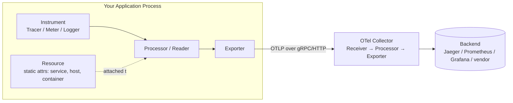
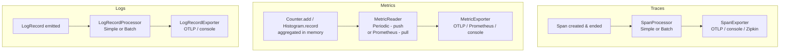
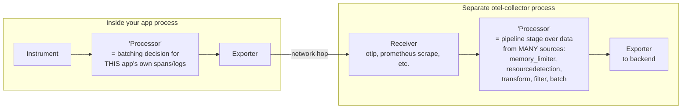

# OpenTelemetry SDK Pipeline — Notes

Personal reference notes on how the OpenTelemetry **SDK** (the part that runs
inside your application process) is put together: the vocabulary, the moving
parts, the popular implementations of each part, and how it differs from the
**Collector** (a separate process telemetry is often sent to next).

Examples below are pulled from a real polyglot app
([opentelemetry-demo](https://github.com/open-telemetry/opentelemetry-demo))
so they're grounded in working code, not just spec text.

---

## 1. The big picture

Every signal (traces, metrics, logs) inside an app follows the same shape:
your code (or an instrumentation library) records something → the SDK buffers
it → an exporter ships it out, usually to a Collector, which then forwards it
to a backend.



Everything on the left (`Instrument → Processor/Reader → Exporter`) lives
**inside your binary** and is configured once at startup via a **Provider**.
Everything on the right is a **separate process** (the Collector) with its
own, differently-named pipeline stages — see [§7](#7-sdk-pipeline-vs-collector-pipeline-dont-confuse-them).

---

## 2. Core vocabulary

| Term | What it is | Analogy |
|---|---|---|
| **Resource** | Static attributes describing *what produced* the telemetry: service name, host, container id, OS, cloud region. Attached once, to every provider. | The "From:" address on every envelope. |
| **Provider** | The top-level factory/owner for one signal (`TracerProvider`, `MeterProvider`, `LoggerProvider`). Created once at startup, holds the processor/reader + exporter + resource config, and is registered globally so any code/library can fetch it. | The post office for one mail category. |
| **Tracer / Meter / Logger** | Obtained from a Provider, scoped to a name (usually your instrumentation library or service name). This is what your code actually calls to create telemetry. | The specific mail clerk you hand your letter to. |
| **Instrument** | A thing you record data with: a `Span` (traces), a `Counter`/`Histogram`/`Gauge` (metrics), a `LogRecord` (logs). | The letter itself. |
| **Processor** | (Traces & logs) In-process component deciding *when* completed spans/log records get handed to the exporter — immediately (`Simple`) or in batches (`Batch`). | Whether the clerk mails each letter individually or waits to fill a mailbag. |
| **Reader** | (Metrics only) Pull-based component that periodically snapshots the *current aggregated state* of all counters/histograms and pushes it through the exporter. Metrics don't have discrete "completed" events the way spans do — they're continuously aggregated in memory — so the mechanism is a puller, not a processor. | A scale that gets read and reset on a timer, not per-transaction. |
| **Exporter** | Serializes telemetry and ships it over the wire (OTLP/gRPC, OTLP/HTTP, Prometheus, console/stdout, vendor-specific). Swappable without touching instrumentation code. | The actual delivery truck. |
| **Propagator** | Serializes/deserializes trace context (trace id, span id, baggage) into a wire format (HTTP headers, Kafka headers) so a downstream service can continue the same trace (`Inject`) or pick it up (`Extract`). | The tracking number written on the package so the next courier knows which shipment it belongs to. |
| **Sampler** | (Traces only) Decides whether a given trace should be recorded/exported at all — `AlwaysOn`, `AlwaysOff`, `TraceIdRatioBased(0.1)`, or `ParentBased(...)` (respect the sampling decision made upstream). Configured on the `TracerProvider`. | Deciding which packages get tracked vs. shipped untracked to save cost. |
| **Context propagation (in-process)** | Carrying the "current active span" through a call chain via `context.Context` (Go), `Context` (Python contextvars), thread-locals, etc., *within one process* — distinct from wire propagators, which cross process boundaries. | Passing a baton hand-to-hand inside one building, vs. shipping it to another building. |

---

## 3. Per-signal pipelines

The three signals share the same overall shape but differ in one key place:
traces/logs use **Processors** (event-driven), metrics use a **Reader**
(state-driven / pull).



### 3.1 Traces

```go
// go.opentelemetry.io/otel/sdk/trace
exporter, _ := otlptracehttp.New(ctx)
tp := sdktrace.NewTracerProvider(
    sdktrace.WithBatcher(exporter),        // BatchSpanProcessor wrapping the exporter
    sdktrace.WithResource(resource),
    sdktrace.WithSampler(sdktrace.ParentBased(sdktrace.TraceIDRatioBased(0.1))),
)
otel.SetTracerProvider(tp)

tracer := tp.Tracer("checkout")
ctx, span := tracer.Start(ctx, "prepareOrder")
defer span.End()
```
Real example: `src/checkout/main.go` (`initTracerProvider`, `PlaceOrder` handler).

### 3.2 Metrics

```go
// go.opentelemetry.io/otel/sdk/metric
exporter, _ := otlpmetrichttp.New(ctx)
mp := sdkmetric.NewMeterProvider(
    sdkmetric.WithReader(sdkmetric.NewPeriodicReader(exporter)), // pulls + pushes every N seconds
    sdkmetric.WithResource(resource),
)
otel.SetMeterProvider(mp)
```
```js
// JS equivalent, hand-instrumented custom metric
const meter = metrics.getMeter('payment');
const transactionsCounter = meter.createCounter('demo.payment.transactions');
transactionsCounter.add(1, { 'demo.payment.currency': currencyCode });
```
Real examples: `src/checkout/main.go` (`initMeterProvider`, provider only — no
custom instruments), `src/payment/charge.js` (custom `Counter`), 
`src/recommendation/metrics.py` (custom `Counter` via `meter.create_counter`).

### 3.3 Logs

```go
// go.opentelemetry.io/otel/sdk/log
logExporter, _ := otlploghttp.New(ctx)
loggerProvider := sdklog.NewLoggerProvider(
    sdklog.WithProcessor(sdklog.NewBatchProcessor(logExporter)),
)
global.SetLoggerProvider(loggerProvider)

logger := otelslog.NewLogger("checkout") // bridges stdlib log/slog into OTel
```
Real example: `src/checkout/main.go` (`initLoggerProvider`).

---

## 4. Popular implementations, per building block

### Exporters
| Exporter | Use case |
|---|---|
| **OTLP/gRPC**, **OTLP/HTTP** | Default choice — ships to a Collector or any OTLP-compatible backend. Most language SDKs default to this if you set `OTEL_EXPORTER_OTLP_ENDPOINT`. |
| **Console / stdout** | Local debugging — print telemetry to your terminal instead of sending it anywhere. |
| **Prometheus** (metrics only) | Doesn't push — exposes a `/metrics` HTTP endpoint that Prometheus scrapes. Notably, the Prometheus exporter *is itself* a `MetricReader` implementation (pull-based), not paired with a separate reader. |
| **Zipkin / Jaeger native** (traces, legacy) | Direct export to those backends without OTLP, mostly seen in older codebases migrating to OTel. |
| Vendor-specific (Datadog, New Relic, etc.) | Usually just an OTLP endpoint + auth headers, sometimes a dedicated exporter package. |

### Trace/Log Processors
| Processor | Behavior | When to use |
|---|---|---|
| **Simple(Span\|LogRecord)Processor** | Exports synchronously, one at a time, as soon as a span ends / log is emitted. | Debugging, tests, low-volume — adds latency to the hot path, don't use in production. |
| **Batch(Span\|LogRecord)Processor** | Buffers in memory, flushes on a timer or when the buffer fills, exports asynchronously in a background goroutine/thread. | Default for production — far fewer network calls, doesn't block request handling. |

### Metric Readers
| Reader | Behavior |
|---|---|
| **PeriodicReader** | Push model — wraps a push-style exporter (OTLP), collects + exports on a fixed interval (default 60s). |
| **Prometheus exporter-as-reader** | Pull model — the reader *is* the Prometheus HTTP handler; Prometheus scrapes it whenever it wants. |
| **ManualReader** | For tests / on-demand collection — you call `Collect()` yourself. |

### Propagators
| Propagator | Format | Notes |
|---|---|---|
| **TraceContext** | W3C `traceparent` / `tracestate` HTTP headers | The modern default, spec-standardized. |
| **Baggage** | W3C `baggage` header | Arbitrary user-defined key/value context, *not* trace identity — travels alongside the trace. |
| **B3** (single or multi-header) | `X-B3-*` headers | Zipkin-originated, still common in systems migrating from Zipkin/Brave. |
| **Composite** | N/A — wraps multiple propagators | `NewCompositeTextMapPropagator(TraceContext{}, Baggage{})` is the typical production default: inject/extract both at once. |

Real example: `src/checkout/main.go` sets a composite `TraceContext + Baggage`
propagator globally, then manually calls `propagator.Inject(...)` before
publishing to Kafka (`createProducerSpan`) since there's no auto-instrumentation
for the Sarama Kafka client. Contrast with `src/fraud-detection` (Kotlin),
which runs under the OpenTelemetry Java **auto-instrumentation agent** — the
agent instruments the Kafka client bytecode directly, so `Inject`/`Extract`
happen invisibly, no application code required.

### Samplers (traces only)
| Sampler | Behavior |
|---|---|
| **AlwaysOn** | Sample everything. Fine for low-traffic services or demos. |
| **AlwaysOff** | Sample nothing (still propagates context, just doesn't export). |
| **TraceIdRatioBased(p)** | Sample a fixed percentage, decided deterministically from the trace ID. |
| **ParentBased(root)** | If this span has a parent, inherit the parent's sampling decision (keeps a trace either fully sampled or fully dropped across services); otherwise fall back to `root` sampler. This is the standard production choice — set on the root/entry service, respected everywhere downstream. |

---

## 5. Real-world usage patterns seen across languages

| Service | Language | Pattern |
|---|---|---|
| `checkout` | Go | Manual SDK wiring (`sdktrace.NewTracerProvider`, etc.) in `main.go`; `otelgrpc`/`otelhttp` instrumentation libraries auto-create spans/metrics for RPC calls; manual `propagator.Inject` for Kafka producer headers. |
| `payment` | Node.js | `meter.createCounter(...)` — hand-written custom business metric (`demo.payment.transactions`). |
| `recommendation` | Python | `meter.create_counter(...)` — same pattern, Python SDK. |
| `fraud-detection` | Kotlin/JVM | Zero manual SDK setup in app code — runs under `-javaagent:opentelemetry-javaagent.jar`, which auto-instruments Kafka, HTTP, gRPC, JDBC, etc. bytecode-level, no `Provider`/`Exporter` code in the app at all. |
| `accounting` | .NET | Manual `ActivitySource` (.NET's native tracing API, which OTel's .NET SDK bridges into) — `StartActivity(...)` — but *no* manual context `Extract` from Kafka message headers, so its consumer spans aren't currently linked back to the producing trace. |

Takeaway: the further "up the stack" a language's ecosystem instrumentation
goes (Java agent > auto-instrumentation libraries > manual SDK calls), the
less pipeline code you write yourself — but you still need to understand
Provider/Processor/Exporter/Propagator to configure *where data goes* and
*how it's sampled/batched*, even if you never call `tracer.Start()` directly.

---

## 6. Shutdown matters

Every Provider must be `Shutdown()` before the process exits, or buffered
(batched) telemetry sitting in memory is lost — this is the #1 cause of
"my traces aren't showing up" for short-lived processes (CLIs, Lambdas,
batch jobs).

```go
tp := initTracerProvider()
defer tp.Shutdown(context.Background()) // flushes any pending batched spans
```

`Shutdown` implies a final flush; some SDKs also expose `ForceFlush()`
separately if you want to flush without tearing down the provider.

---

## 7. SDK pipeline vs. Collector pipeline — don't confuse them

Same vocabulary word ("processor"), two unrelated components, two different
processes.



| | SDK-level "Processor" | Collector-level "processor" |
|---|---|---|
| Runs where | Inside your app's process | Separate `otel-collector` process |
| Operates on | This app's own spans/logs only | Data already received from many apps |
| Job | Simple vs. batched handoff to *this app's* exporter | Transform, filter, sample, enrich, protect memory, batch for the network hop onward |
| Config surface | Code (`sdktrace.WithBatcher(...)`) | YAML (`processors: {memory_limiter, batch, transform, ...}` + `service.pipelines`) |
| Examples | `BatchSpanProcessor`, `SimpleLogRecordProcessor` | `memory_limiter`, `resourcedetection`, `transform` (OTTL), `filter`, `batch` |

Confusingly, the Collector is *itself* a Go program built on the OTel Go SDK
for its own self-observability — so its `service.telemetry.metrics.readers`
/ `service.telemetry.logs.processors` config block uses the exact same
SDK-level vocabulary (`PeriodicReader`, `BatchProcessor`) to describe how the
Collector exports metrics/logs *about itself*. That's the SDK layer, just
running inside the Collector binary instead of your application binary.

---

## 8. One-paragraph mental model

A **Provider** is created once per signal at startup, owns a **Resource**
(who's producing this), and is registered globally. Your code (or an
instrumentation library) gets a **Tracer/Meter/Logger** from it and creates
**Instruments** (spans, counters, log records). Traces and logs flow through
a **Processor** that decides simple-vs-batched handoff to an **Exporter**;
metrics instead accumulate in memory and get pulled out on a schedule by a
**Reader**, which then pushes through an **Exporter**. Crossing a process
boundary (HTTP, gRPC, Kafka headers) requires a **Propagator** to serialize
the active trace context out (`Inject`) and rebuild it on the other side
(`Extract`) — otherwise you get two disconnected traces instead of one.
Everything downstream of the exporter (the Collector's receivers/processors/
exporters) is a different service with a different, YAML-configured pipeline
that happens to reuse some of the same words.
